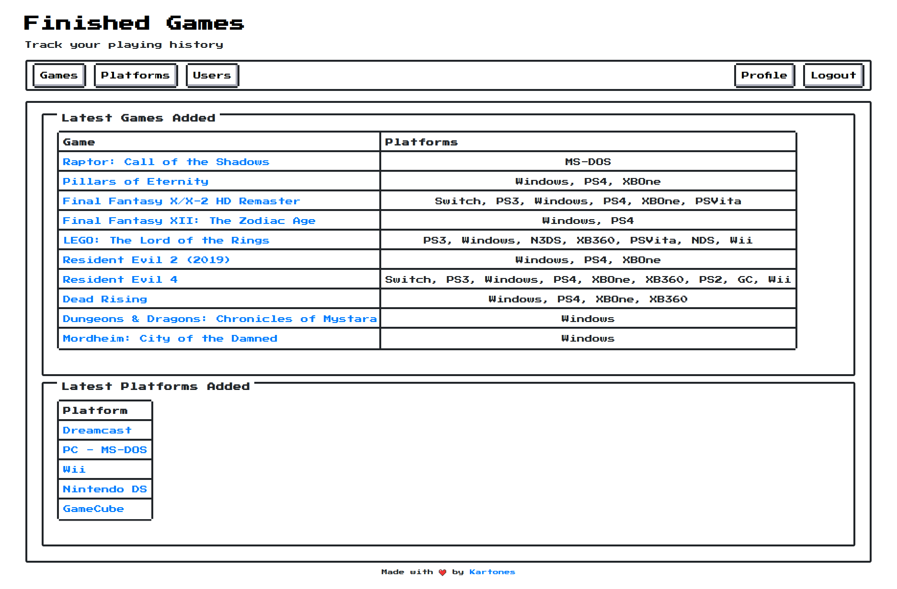
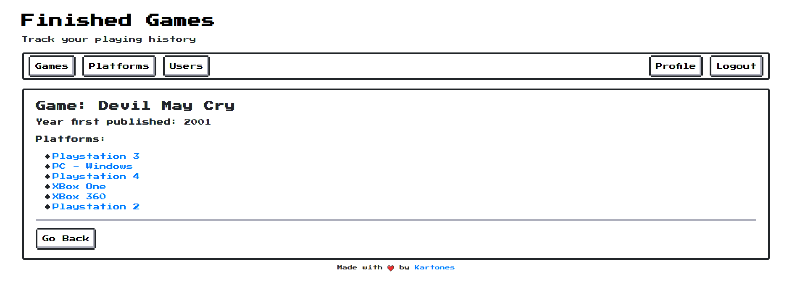
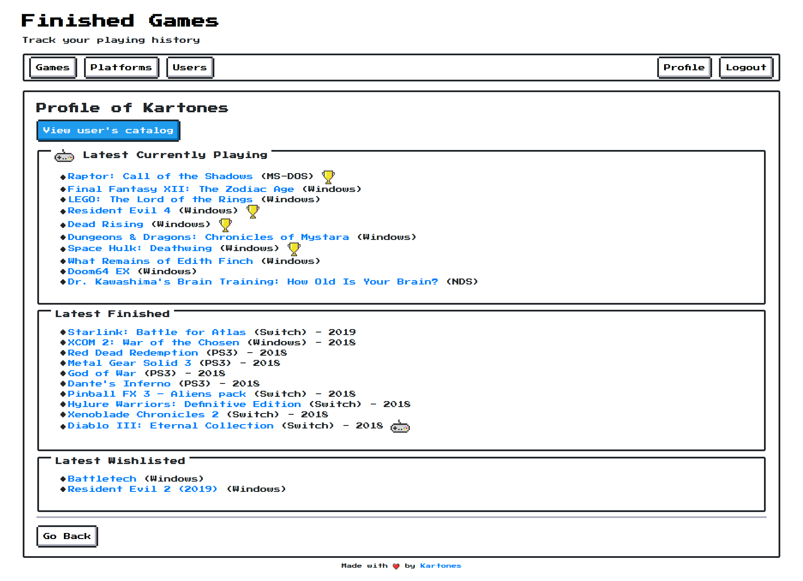
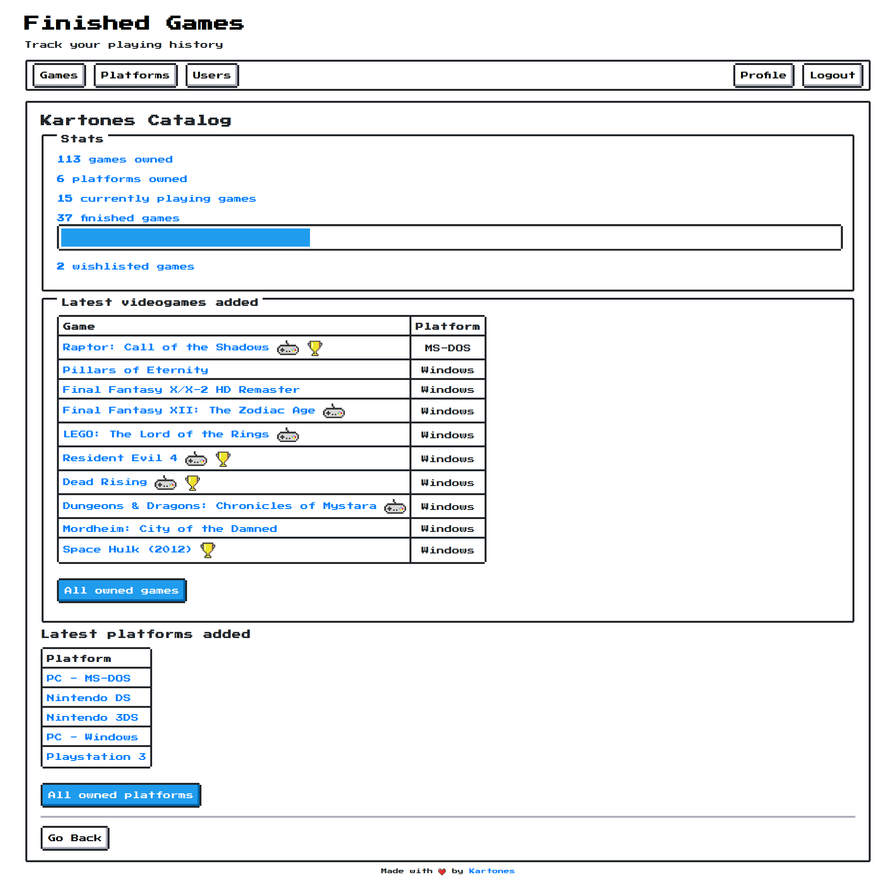
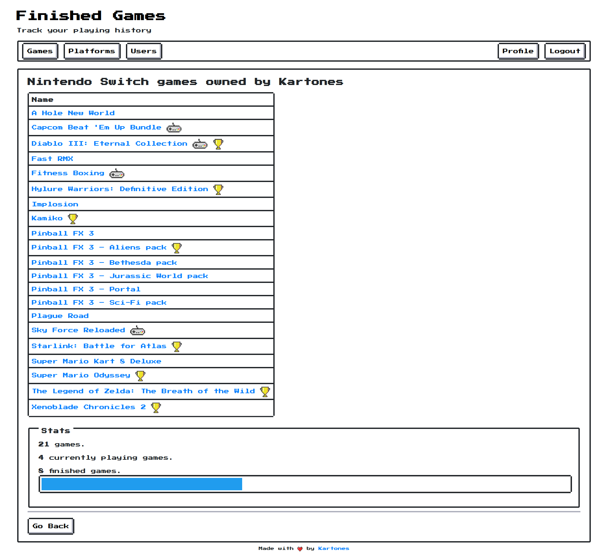
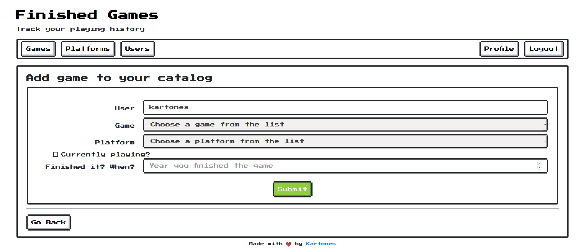

# Finished Games

## Intro

Finished games is a small personal project whose purposes are:

**1) To provide an easy to use videogames catalog tracking, both for your owned titles (and videogame platforms), which ones have you finished or are currently playing, and to keep a wishlist of interesting games you desire.** I'm going to use it frequently and wanted to build it my way.

**2) To practice fully developing a website with Django 2.x.** On my daily work I don't get to touch all the pieces that the framework provides, plus I can learn how to setup `pytest` to run Django `TestCases`, add type hinting everywhere and other personal tastes.

**3) To learn data fetching, scrapping, gathering, etc.**, so managing the database of game titles becomes as automated as possible.

**4) To learn React, so when the project is "MVP ready" I have the idea of rewriting it**. Django will handle the backend as a REST API and the frontend will be redone from scratch in `React`, `Redux` and/or whatever fits best (I'm still learning). It will be properly tagged/marked so the Django only version could still be accessed.


Some screenshots:

Homepage:


Game details:


A user public profile:


The user catalog main page:


User games catalog filtered by platform:


Form to add an existing game to the user's catalog:


You can see a live demo of the project at [https://finishedgames.kartones.net](https://finishedgames.kartones.net) (user accounts restricted to only friends, not for public use, sorry!).

This project uses the awesome [NES.CSS Framework from nostalgic-css](https://github.com/nostalgic-css/NES.css).

### Notes

Not all functionality is yet implemented, expect missing basic features until reaching MVP 1.1.

There is a roadmap but for now internal, I do plan to make the site fully usable without needing to rely on django-admin, I'll eventually add an autocomplete textfield for selecting the game and/or platform, and other basic features, all before considering MVP 1.1 done.

## Setup

This project requires `Python >= 3.6`, `Docker` and `Docker Compose`. Other requirements are specified in the corresponding `requirements.txt` and `requirements-dev.txt` files but are installed inside the containers.

Requirements are not version-pinned on purpose, if a build fails due to some new version breaking change it will be triaged and solved accordingly.

To run pending migrations (both initial setup and after an update that brings new ones):
```
make shell
python manage.py migrate
```

To create an administrator/super-user (you'll need one to then create normal users from the Admin):
```
make shell
python manage.py createsuperuser
```

To setup the production settings, my recommendation (and the .gitignored file) is to create a `finishedgames/finishedgames/settings/prod.py` file and there setup your secrets (secret key, database credentials, allowed_hosts, etc.).

Also remember that you need to [setup the statics](https://docs.djangoproject.com/en/2.1/howto/static-files/) for production (and run `python manage.py collectstatic`) when going live, for development it works out of the box.

## Running

To launch the website in development, just run:
```
make run
```

Once loaded the site will be available from [http://0.0.0.0:5000/](http://0.0.0.0:5000/) .

Admin site is accessible from [http://0.0.0.0:5000/admin/](http://0.0.0.0:5000/admin/) .


**NOTE:** Data creation and most management is done from the Admin site, currently the website only allows to associate existing data to existing users. Although some functionality will be added before, until  building the React version (MVP 2) full data management will only be available from the admin.


## Development

Running tests (including type hint checking with `mypy` and `flake8` linting):
```
make test
```

To obtain the code coverage:
```
make coverage
```
Note: If not run under Linux, will fail after generating the coverage as will try to open the file `cov_html/index.html` in the default browser with `xdg-open`.


To create a new migration, edit the models at `core` and then:
```
make shell
python manage.py makemigrations core
```
Or if you need a data migration (remember to add your operation using `RunPython()`, like `migrations.RunPython(populate_platform_published_date_field)`):
```
make shell
python manage.py makemigrations --empty core
```

To run a Django shell if you need it:
```
make shell
python manage.py shell
```

### Development tips

Demo of all [NES.css](https://github.com/nostalgic-css/NES.css) available components: https://nostalgic-css.github.io/NES.css/ . Note that this website uses that project CSS but has replaced most external assets (at the moment just some PNG cursors) by local statics, so updates to it are handled manually at the moment.


Personal recommendation of IDE for SQLite browsing: [DB Browser for SQLite](https://sqlitebrowser.org/)


To see the SQL query of an ORM query, use the `.query` property on `QuerySet` objects:
```
print(latest_finished_games.query)
```

## Roadmap

See [Projects page](https://github.com/Kartones/finished-games/projects?query=is%3Aopen+sort%3Aname-asc) for individual task details.

Note that the second MVP means a radical departure from the current one, so a release tag will be created before embarking in the second phase (it can be useful as a "django starter kit").

**Warning**: Until reaching MVP 1 "ready" state, all code, UI and DB schemas are subject to change. Then upon starting MVP 2 until its "ready" state again, expect heavy changes and no guaranteed backwards compatibility.

### MVP 1

Django only version, either without javascript or minimal one just to be able to use the site. Main goal is to have the system working and usable by users. Data ingestion either manually (through Django-admin) or via scripts (and probably Django commands).

### MVP 1.1

Adding CircleCI integration (free for public repos), bugfixes and some additions like wishlisting games and removing games from wishlist or from the user catalog. Plus probably data ingestion from one or two sources (I am the "most interested user" and I have and have played a lot of games!)

### MVP 2

Throw away Django templates and transform existing views into a REST-like API, then create a separate project for the frontend to be built as an SPA using React (but keeping current design).

## License

See [LICENSE](LICENSE).
