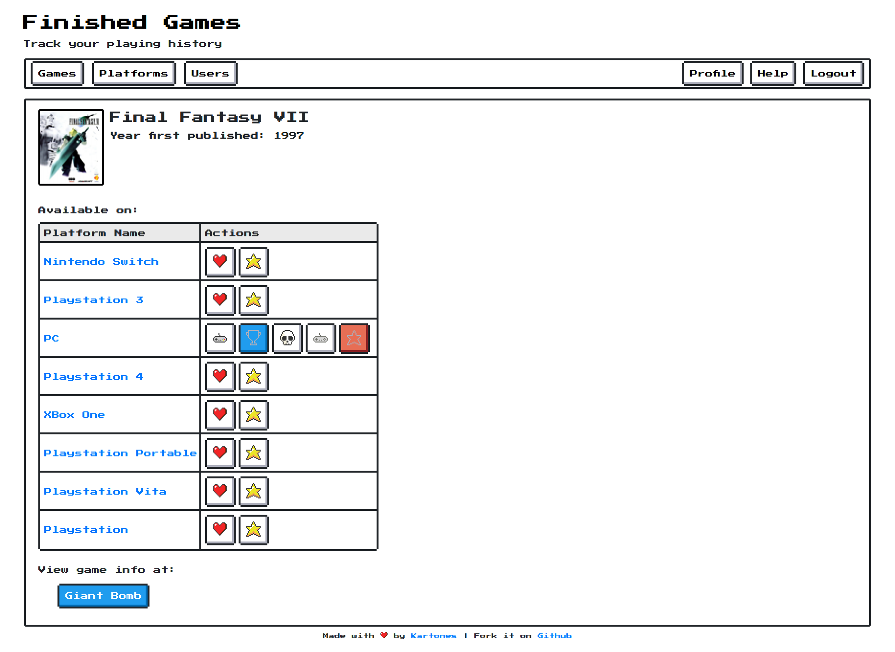
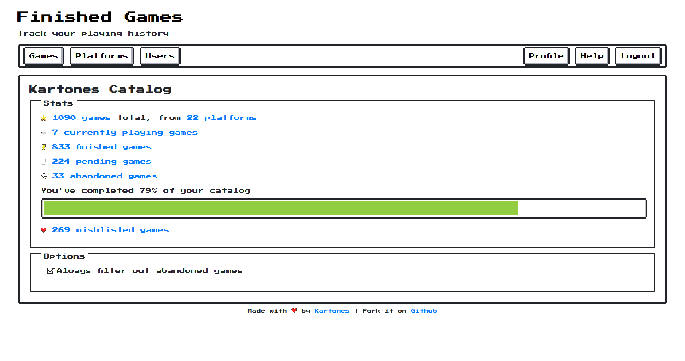

[](https://circleci.com/gh/Kartones/finished-games/tree/master)


# Finished Games

## Intro

Finished games is a small personal project whose purposes are:

**1) To provide an easy to use videogames catalog tracking, both for your owned titles (and videogame platforms), which ones have you finished or are currently playing, and to keep a wishlist of interesting games you desire.** I'm going to use it frequently and wanted to build it my way.

**2) To practice fully developing a website with Django 2.x.** On my daily work I don't get to touch all the pieces that the framework provides, so this project is a good way to fix that.

Near the end of this README you will find detailed lists of libraries and django features used.


Some screenshots:

Homepage:


Game details:


A user catalog page:


User games catalog filtered by platform:


Django admin views to manage `Games` and `Platforms`:


### Notes

Javascript uses features from ES2015 and assumes a modern browser, which means: not outdated Firefox, Chrome, Safari or Edge. Internet Explorer and other older browsers are not supported.

The Docker Python image is already compatible with variable type hints (>= 3.6), but as many OS still come with as much as 3.5, like Ubuntu, keeping variable type annotations as comments for now so they run with Python 3.5.

## Setup

This project requires `Docker` and `Docker Compose` to be built (only Python to run). Python required version is minimum `3.5`, but the Docker container is built with `3.7`. Django version is `2.2` so anyway you need Python >= 3.5.

This project is almost on maintenance mode, so a Django `3+` migration is highly unlikely.

Python package requirements are specified in the corresponding `requirements.txt` and `requirements-dev.txt` files. These packages are installed inside the containers in development and testing.

To run pending migrations (both initial setup and after an update that brings new ones):
```
make shell
python manage.py migrate
```

To create an administrator/super-user (you'll need one to then create normal users from the Admin):
```
make shell
python manage.py createsuperuser
```

## Running

To launch the website in development, just run:
```
make run
```

Once loaded the site will be available from [http://0.0.0.0:5000/](http://0.0.0.0:5000/).

Admin site is accessible from [http://0.0.0.0:5000/admin/](http://0.0.0.0:5000/admin/).

**NOTE:** Some data creation and management is done from the Admin site. One of the principles of this project is not repeating work already done or more easily done from the Django Admin.

## Fetching and importing from external sources

You can manually add `Games` and `Platforms` to your catalog, but this can become a titanic task. The included `catalogsources` django app provides an extensible adapter-based system to fetch data from external sources that provide APIs. This repo includes a connector for [GiantBomb](https://www.giantbomb.com/api/), but **you must always request your own API keys and setup them** (see `finishedgames/finishedgames/settings/prod.py.sample` for expected configuration format).

Once you have added your key(s) to the settings, you can invoke fetching of platforms using a Django command:
```
# Command accepts one or more source_ids
python3 manage.py fetch_platforms <source_id_1> [<source_id_2> ...]
```

Or, once you have fetched platforms from a given source, fetch games of one or more fetched platform ids:
```
# Command accepts one source_id but multiple platform_ids
python3 manage.py fetch_games <source_id> <platform_id_1> [<platform_id_2> ...]
```

Now you will contain `Fetched Platforms` and `Fetched Games`, which you need to add to the main catalog (so they appear on the website), or hide them if you do not wish to import. This allows to make changes, handle conflicts, and the like without editing live data.

When using the Admin site to browse fetched items, there are custom convenience *Actions* available, like marking as hidden or importing to the main catalog.

There's also a handy and self-descriptive command:
```
# import up to 500 new games; exclude_unreleased skips those with date `1970` (unknown or, typically, not yet released)
python3 manage.py import_fetched_games_without_fg_game 500 --exclude_unreleased
```

Then, when a game becomes updated, either from a fetch (e.g. gets released on new platforms) or from a manual edit in the admin interface, its `sync` state will be `false`. You can filter to see only un-synced games, and sync them from the web, but again there's a command that will do smart sync:
```
# sync up to 500 games out of sync
python3 manage.py sync_games 500
```
The command will sync:
- Game cover
- Publish date (if greater than imported game's publish date)
- New platforms (platforms not already present in the imported game). Note that it won't remove platforms.


----


Sample screenshot of a games fetch command execution:


There are customized django views to manage all the fetched data:


### Fetch and import flow

```
             +----------------+   +--------------+   +------------------+
             | django command |   | django admin |   | main catalog/web |
+--------+   |----------------|   |--------------|   |------------------|
|        |   |                |   |              |   |                  |
| source +-->|    fetch_xxx   +-->|  import xxx  +-->| <item available> |
|        |   |                |   |              |   |                  |
+--------+   +----------------+   +--------------+   +------------------+
                                          ^                   ^
                                          |                   |
                                          |                   |
                                          v                   v
                                 +-----------------+     +----------+
                                 |                 |     |          |
                                 | FetchedGame     |     | Game     |
                                 | FetchedPlatform |     | Platform |
                                 |                 |     |          |
                                 +-----------------+     +----------+
```

## Development

Running tests (including type hint checking with `mypy`):
```
make test
```

To obtain the code coverage:
```
make coverage
```
Note: If not run under Linux, will fail after generating the coverage as will try to open the file `cov_html/index.html` in the default browser with `xdg-open`.


To create a new migration, edit the models at `core` and then:
```
make shell
python manage.py makemigrations core
```
Or if you need a data migration (remember to add your operation using `RunPython()`, like `migrations.RunPython(populate_platform_published_date_field)`):
```
make shell
python manage.py makemigrations --empty core
```

To run a Django shell if you need it:
```
make shell
python manage.py shell
```

### Commiting code and Code Formatting

You must install `pre-commit` to run the formatters and some linters upon commiting code:
```
python3 -m pip install pre-commit --user
pre-commit install
```

### Development tips

- Demo of all [NES.css](https://github.com/nostalgic-css/NES.css) available components: https://nostalgic-css.github.io/NES.css/ . Note that this website uses a project fork, as they dropped (at least for now) support for Firefox while older versions worked fine.


- Personal recommendation of IDE for SQLite browsing: [DB Browser for SQLite](https://sqlitebrowser.org/)


- To see the SQL query of an ORM query, use the `.query` property on `QuerySet` objects:
```
print(latest_finished_games.query)
```


- To check if there are new versions of the dependencies
```
make shell
python3 -m pip list --outdated
```

## Deployment


To setup the production settings, copy `finishedgames/finishedgames/settings/prod.py.sample` to `finishedgames/finishedgames/settings/prod.py` and setup your secrets (secret key, database credentials, etc.). You should **never** remove the `prod.py` file from `.gitignored` list as you could commit your production credentials.

Also remember that you need to [setup the statics](https://docs.djangoproject.com/en/2.1/howto/static-files/) for production when going live, for development it works out of the box. To prepare the statics, run `make statics`.


## Technical Details

#### Libraries and tools

- `Docker`: for development and testing, partially done for production
- `requests`: for fetching APIs and game covers
- `pillow`: to manipulate and convert game covers
- `pytest`: configured to run django `TestCase` tests, including code coverage generation and `pytest-randomly` to shuffle test suites order
- `mypy`: Fully typed code, including django classes
- Rate-limiting (custom implementation based on a token bucket algorithm)
- `mypy` mandatory linter test (any broken rule fails tests run)
- `isort` & `black` auto-formatters upon commit (automatically reformat files)
- configuration hierarchy (`base -> dev/prod/test -> local`), including different default SQLite DB
- Tiny Javascript footprint: djando admin uses some vanilla JS and jQuery, website uses only vanilla JS.


#### Django features

- Django >= 2.2 , < 3
- Extensive ORM usage, including `select_related()` and `prefetch_related()`, query optimizations (`only()`, `values_list()`, ...)
- custom model managers
- `Paginator` component for pagination
- custom management commands
- custom template tags (with and without rendering templates) and filters
- admin custom ordering, filters, fieldsets, readonly fields, search fields...
- custom admin actions, decorators, filters, forms, form fields (a handy non-pg dependant `SimpleArrayField`) and views
- `django-debug-toolbar`: Disabled on production for security


## License

See [LICENSE](LICENSE).

## Various

CSS are [a customized fork](https://github.com/kartones-forks/NES.css) of the awesome [NES.CSS Framework from nostalgic-css](https://github.com/nostalgic-css/NES.css).

ASCII diagram built with [ASCIIFlow](http://www.asciidraw.com).