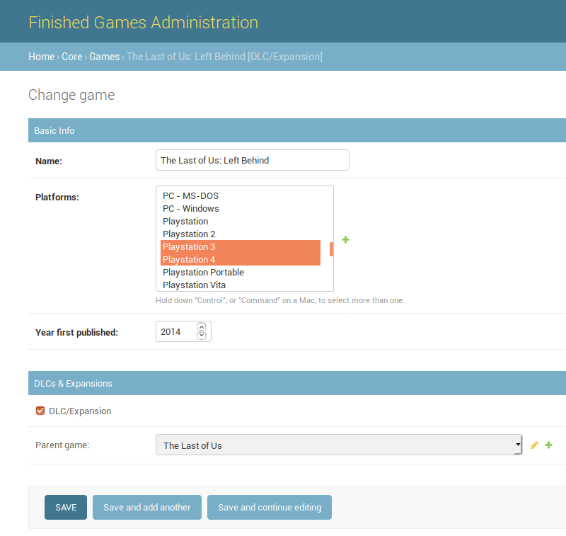

Tests: [](https://circleci.com/gh/Kartones/finished-games/tree/master)

# Finished Games

## Intro

Finished games is a small personal project whose purposes are:

**1) To provide an easy to use videogames catalog tracking, both for your owned titles (and videogame platforms), which ones have you finished or are currently playing, and to keep a wishlist of interesting games you desire.** I'm going to use it frequently and wanted to build it my way.

**2) To practice fully developing a website with Django 2.x.** On my daily work I don't get to touch all the pieces that the framework provides, plus I can learn how to setup `pytest` to run Django `TestCases`, add type hinting everywhere with `mypy` and other personal tastes, like `pytest` for testing (including running Django testcases).


Some screenshots:

Homepage:


Game details:


A user public profile:


The user catalog main page:


User games catalog filtered by platform:


Form to add an existing game to the user's catalog:


Django admin views to manage `Games` and `Platforms`:



You can see a live demo of the project at [https://finishedgames.kartones.net](https://finishedgames.kartones.net) (user accounts restricted to only friends, not for public use, sorry!).

Also, [navigating to the help](https://finishedgames.kartones.net/help/) quickly explains the meaning of the action buttons.

### Notes

Javascript uses features from ES2015 and assumes a modern browser, which means: not outdated Firefox, Chrome, Safari or Edge. Internet Explorer and other older browsers are not supported.

Not all functionality is yet implemented, expect missing basic features until reaching MVP 1.1.

There is a roadmap but for now internal, I do plan to make the site fully usable without needing to rely on django-admin, I'll eventually add an autocomplete textfield for selecting the game and/or platform, and other basic features, all before considering MVP 1.1 done.

The Docker Python image is already compatible with variable type hints (>= 3.6), but as many OS still come with as much as 3.5, like Ubuntu, keeping variable type annotations as comments for now so they run with Python 3.5.

## Setup

This project requires `Docker` and `Docker Compose` to be built (only Python to run). Python required version is minimum `3.5`, but the Docker container is built with `3.7`. Django version is `2.2` so anyway you need Python >= 3.5.

Python package requirements are specified in the corresponding `requirements.txt` and `requirements-dev.txt` files. These packages are installed inside the containers in development and testing.

Most requirements are not version-pinned on purpose, if a build fails due to some new version breaking change it will be triaged and updated accordingly.

To run pending migrations (both initial setup and after an update that brings new ones):
```
make shell
python manage.py migrate
```

To create an administrator/super-user (you'll need one to then create normal users from the Admin):
```
make shell
python manage.py createsuperuser
```

## Running

To launch the website in development, just run:
```
make run
```

Once loaded the site will be available from [http://0.0.0.0:5000/](http://0.0.0.0:5000/) .

Admin site is accessible from [http://0.0.0.0:5000/admin/](http://0.0.0.0:5000/admin/) .

**NOTE:** Some data creation and management is done from the Admin site. One of the principles of this project is not repeating work already done or more easily done from the Django Admin.

## Fetching and importing from external sources

You can manually add `Games` and `Platforms` to your catalog, but this can become a titanic task. The included `catalogsources` django app provides an extensible adapter-based system to fetch data from external sources that provide APIs. This repo includes connectors for [GiantBomb](https://www.giantbomb.com/api/) and [MobyGames](https://www.mobygames.com/info/api), but **you must always request your own API keys and setup them** (see `finishedgames/finishedgames/settings/prod.py.sample` for expected configuration format).

Once you have added your key(s) to the settings, you can invoke fetching of platforms using a Django command:
```
# Command accepts one or more source_ids
python3 manage.py fetch_platforms <source_id_1> [<source_id_2> ...]
```

Or, once you have fetched platforms from a given source, fetch games of one or more fetched platform ids:
```
# Command accepts one source_id but multiple platform_ids
python3 manage.py fetch_games <source_id> <platform_id_1> [<platform_id_2> ...]
```

Sample screenshot of a games fetch command execution:


There are customized django views to manage all the fetched data:


And you can import both `Fetched Platforms` and `Fetched Games` to the main catalog (so they appear on the website), or hide them if you do not wish to import them.

No detailed instructions are provided on how to work with fetched items, but don't worry about your existing catalog, fetched data always goes to different tables and must be manually imported into the catalog to avoid overriding things by mistake.

When using the Admin site to browse fetched items, there are custom convenience *Actions* available, like marking as hidden or importing to the main catalog.

### Fetch and import flow

```
             +----------------+   +--------------+   +------------------+
             | django command |   | django admin |   | main catalog/web |
+--------+   |----------------|   |--------------|   |------------------|
|        |   |                |   |              |   |                  |
| source +-->|    fetch_xxx   +-->|  import xxx  +-->| <item available> |
|        |   |                |   |              |   |                  |
+--------+   +----------------+   +--------------+   +------------------+
                                          ^                   ^
                                          |                   |
                                          |                   |
                                          v                   v
                                 +-----------------+     +----------+
                                 |                 |     |          |
                                 | FetchedGame     |     | Game     |
                                 | FetchedPlatform |     | Platform |
                                 |                 |     |          |
                                 +-----------------+     +----------+
```

## Development

Running tests (including type hint checking with `mypy` and `flake8` linting):
```
make test
```

To obtain the code coverage:
```
make coverage
```
Note: If not run under Linux, will fail after generating the coverage as will try to open the file `cov_html/index.html` in the default browser with `xdg-open`.


To create a new migration, edit the models at `core` and then:
```
make shell
python manage.py makemigrations core
```
Or if you need a data migration (remember to add your operation using `RunPython()`, like `migrations.RunPython(populate_platform_published_date_field)`):
```
make shell
python manage.py makemigrations --empty core
```

To run a Django shell if you need it:
```
make shell
python manage.py shell
```

### Development tips

- Demo of all [NES.css](https://github.com/nostalgic-css/NES.css) available components: https://nostalgic-css.github.io/NES.css/ . Note that this website uses that project CSS but has removed unused assets and replaced external images by local ones, so updates to it are handled manually at the moment.


- Personal recommendation of IDE for SQLite browsing: [DB Browser for SQLite](https://sqlitebrowser.org/)


- To see the SQL query of an ORM query, use the `.query` property on `QuerySet` objects:
```
print(latest_finished_games.query)
```

## Deployment


To setup the production settings, copy `finishedgames/finishedgames/settings/prod.py.sample` to `finishedgames/finishedgames/settings/prod.py` and setup your secrets (secret key, database credentials, etc.). You should **never** remove the `prod.py` file from `.gitignored` list as you could commit your production credentials.

Also remember that you need to [setup the statics](https://docs.djangoproject.com/en/2.1/howto/static-files/) for production when going live, for development it works out of the box. To prepare the statics, run `make statics`.


## Roadmap

Note that the second MVP means a radical departure from the current one, so, if tackling it, a release tag will be created before embarking in the second phase (it can be useful as a "django starter kit").

**Warning**: Until reaching end of MVP 1.1, all code, UI and DB schemas are subject to change. Then upon starting MVP 2 until its "ready" state again, expect heavy changes and no guaranteed backwards compatibility.

### ☑️  MVP 1

Django only version, either without javascript or minimal one just to be able to use the site. Main goal is to have the system working and usable by users. Data ingestion either manually (through Django-admin) or via scripts (and probably Django commands).

### MVP 1.1

Adding CircleCI integration (free for public repos), bugfixes and some additions like wishlisting games and removing games from wishlist or from the user catalog. Plus probably data ingestion from at least two sources (I am the "most interested user" and I have and have played a lot of games!)

### MVP 2 (Optional)

Throw away Django templates and transform existing views into a REST-like API, then create a separate project for the frontend to be built as an SPA using React (but keeping current design).

## License

See [LICENSE](LICENSE).

## Various

CSS are [a customized fork](https://github.com/kartones-forks/NES.css) of the awesome [NES.CSS Framework from nostalgic-css](https://github.com/nostalgic-css/NES.css).

ASCII diagram built with [ASCIIFlow](http://www.asciidraw.com).